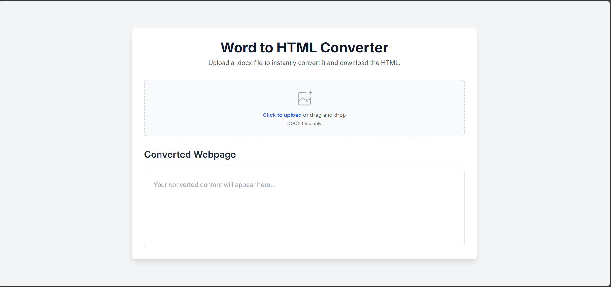

# Word to HTML Convertor

Welcome to the **Word to HTML Convertor** repository! This project provides a simple and efficient way to convert Word documents into clean HTML code, making it easier to publish documents on the web.

## Features

- Upload and convert Word files (`.docx`) to HTML.
- Preview the converted HTML directly on the webpage.
- Download the HTML output for use in other projects.

## Getting Started

1. **Clone the repository:**
   ```bash
   git clone https://github.com/Maghizhan-05/word_to_html_convertor.git

Webpage Preview
Below is a sample preview of the main webpage:



Usage
Upload your Word file using the upload button.
Click "Convert" to generate the HTML code.
Preview the result in the output area.
Download or copy the HTML for your use.
Contributing
Pull requests are welcome! For major changes, please open an issue first to discuss what you would like to change.

Made with ❤️ by Maghizhan-05
